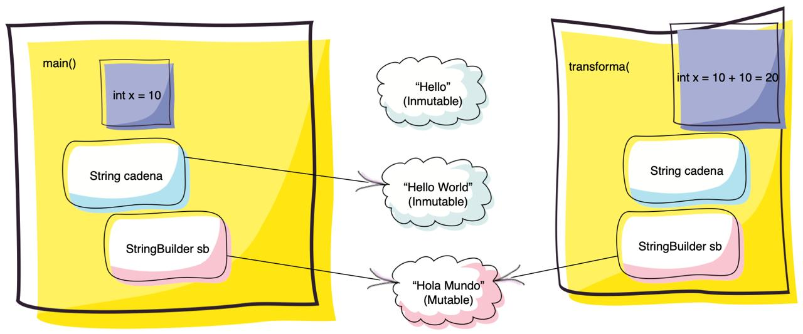

# academyMty — Ejercicios de clase

Código que trabajamos en vivo durante las sesiones de Java de la **Academia Monterrey**.

Cada proyecto es un proyecto de Eclipse independiente. Dentro de cada uno, los paquetes
`com.curso.v0`, `v1`, `v2`, `v3` son **versiones sucesivas del mismo ejemplo**: v0 es el punto
de partida y cada versión siguiente cambia una sola cosa para que se vea el efecto. Conviene
leerlos en ese orden.

Varias líneas están **comentadas a propósito**: son los casos que no compilan o que truenan en
ejecución. Descoméntalas y observa el error — ese es el ejercicio.

---

## `Inicio` — Objetos, polimorfismo y casting

| Paquete | Archivo | Tema |
|---|---|---|
| `v0` | `Principal` | Qué imprime realmente `System.out.println(objeto)`. **No es la dirección de memoria.** |
| `v1` | `Principal` | Sobrescribir `hashCode()` y `equals()` y ver cómo cambia lo anterior. |
| `v1` | `Principal2` | Polimorfismo: una referencia `Ave` apuntando a `Pinguino`, `Aguila`, `Perico`. |
| `v2` | `Principal` | El padre aporta `volarAve()`; para llegar a `volarPerico()` hace falta un cast. |
| `v2` | `Principal2` | `String` es inmutable: `concat()` no modifica, devuelve otro objeto. |
| `v3` | `Principal` | Jerarquía de 3 niveles: **upcast**, **downcast**, `instanceof` y `ClassCastException`. |

## `static_java` — Instancia vs. clase

| Paquete | Tema |
|---|---|
| `v0` | Método de instancia (`new Principal().transforma(...)`) contra método de clase (`static`). |
| `v1` | `contador` como atributo de instancia: cada `Pato` lleva el suyo, los tres imprimen `1`. |
| `v2` | `contador` como `static`: se comparte entre todos, los tres imprimen `3`. |
| `v3` | Encapsulamiento: `private static` + `getContador()` estático. |

## `final_java` — La palabra `final`

| Paquete | Tema |
|---|---|
| `v0` | `final` sobre un primitivo, sobre un mutable (`StringBuilder`) y sobre un inmutable (`String`). La clave: **`final` congela la referencia, no el contenido.** |
| `v1` | `final class Ave` — una clase final no se puede heredar (descomenta `Pato extends Ave`). |
| `v2` | Ahora `final` va en los **métodos**, no en la clase: `Pato` sí puede heredar, pero no puede sobrescribir `volarAve()`. Y el `static final volar()` marca la diferencia entre **sobrescribir** y **ocultar** (`HIDDEN`): un método de clase no se sobrescribe. |

## `stringStringBuilder` — String vs. StringBuilder

| Paquete | Archivo | Tema |
|---|---|---|
| `v0` | `Principal` | Concatenar `String` dentro de un ciclo de 1,000,000 de iteraciones. Ojo al tiempo. |
| `v0` | `Principal1` | El mismo ciclo con `StringBuilder.append()`. Compara. |
| `v0` | `Principal2` | `String` sobrescribe `equals()` → `true`. `StringBuilder` **no** → `false`. |
| `v1` | `Principal` | `equals()` propio en `Pato`, comparando con `==`. ¿Por qué funciona aquí y cuándo dejaría de hacerlo? |

## `paso_parametros` — Qué le pasa a un argumento al entrar a un método

| Paquete | Tema |
|---|---|
| `v0` | Se pasan un `int`, un `String` y un `StringBuilder` al mismo método. Uno de los tres vuelve cambiado al `main`. **Java siempre pasa por valor** — lo que se copia es la referencia, no el objeto: por eso `sb.append()` sí se ve fuera y `x = x + 10` no. |

Dentro del método, `cadena` sigue valiendo `Hello`: `concat()` devuelve **otro** `String` y por eso hay que
retornarlo. Las dos líneas comentadas están ahí para comprobarlo.

### El diagrama de la clase



Cómo se lee, elemento por elemento:

| En el dibujo | En el código |
|---|---|
| Los **dos post-its** | Dos marcos de pila distintos: `main()` y `transforma()`. Cada uno con sus propias variables. |
| **Dos cajas `int x`** | `x = x + 10` cambia la de `transforma` (pasa a 20). La de `main` sigue en 10 y ni se entera. |
| Las **nubes** | El heap. `cadena` y `sb` no guardan el objeto: guardan **a dónde apuntar**. Eso es lo que se copia al llamar al método. |
| Los **dos `sb` a la misma nube** | Una sola nube `"Hola Mundo"`, dos referencias. Por eso `sb.append()` sí se ve desde `main`. |
| `"Hello World"` es una nube **aparte** | `concat()` no tocó `"Hello"`: creó otro objeto. Por eso hay que **retornarlo** — si no, se pierde. |
| `"Hello"` sin ninguna flecha | Ya nadie la apunta: es basura para el recolector. |

Ese es el resumen en una frase: **Java siempre pasa por valor.** Lo que se copia es la referencia,
nunca el objeto — y por eso puedes *modificar* lo que hay al otro lado, pero no puedes *cambiar a
dónde apunta* la variable del que te llamó.

---

## Cómo abrirlo en Eclipse

1. Clona el repositorio:
   ```bash
   git clone https://github.com/cursosmrugerio/academyMty.git
   ```
2. En Eclipse: **File → Import… → General → Existing Projects into Workspace**.
3. Selecciona la carpeta `academyMty` y marca **Search for nested projects**.
4. Importa los cinco proyectos.

Solo se versiona el código fuente (`src/`). Las clases compiladas (`bin/`) las genera Eclipse
al importar, por eso no están en el repositorio.
